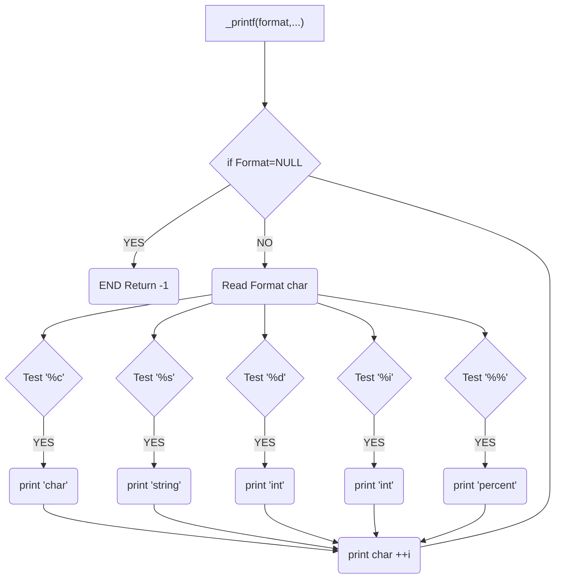

# **Holberton School C#26 Project _printf**


## A brief description📖

The `_printf` project is a redesign of the printf function from the C standard library. This function allows you to display formatted data to standard output `<stdio.h>`, supporting various types and format specifiers. The main goal is to better understand the internals of this function while improving your skills in system programming and memory management.

## Compilation command🛠️

To compile the program, use the following command:
`gcc -Wall -Werror -Wextra -pedantic -std=gnu89 -Wno-format *.c -o`

## MAN Page📋
A man page is included to describe in detail the usage and specifiers supported by `_printf`. To access the page, use your domain copy / paste :

```c
cp ~/holbertonschool-printf/man_3_printf /usr/local/share/man/man1/_printf.1
```
Next use the command `man _printf` to display man

## Requirements🗂️

All files are written with [betty style](https://www.holbertonschool.fr/post/quest-ce-que-la-regle-betty-dans-le-langage-de-programmation-c) and the will be compiled on Ubuntu 20.04 LTS using `gcc`, using the options `-Wall -Werror -Wextra -pedantic -std=gnu89`

## Authorized functions and macros🔐

`write` `malloc` `free` `va_start` `va_end` `va_copy` `va_arg`

## Example🗃️
Here is an example to better understand⤵️

```c
#include <stdio.h>
#include <string.h>
#include "main.h"

int main(void)
{
_printf("Mission Control to Spacecraft:\n");
_printf("We have %d planets in view\n", 8);
_printf("Current target: %s\n", "Mars");
_printf("Fuel at %i%%, engine status: %c\n", 65, 'G');
_printf("All systems at 100%%\n");
_printf("Commencing countdown...\n");
return (0);
}
```
Output⤵️
```bash
Mission Control to Spacecraft:
We have 8 planets in view
Current target: Mars
Fuel at 65%, engine status: G
All systems at 100%
Commencing countdown...
```

## Repository files list⚙️

| File name | Description                |
| :-------- | :------------------------- |
|[_printf.c](https://github.com/SebSa12000/holbertonschool-printf/blob/main/_printf.c) |  the main function `_printf`|
|[_putchar.c](https://github.com/SebSa12000/holbertonschool-printf/blob/main/_putchar.c) | `_putchar` command permitting to print a character              |
|[main.h](https://github.com/SebSa12000/holbertonschool-printf/blob/main/main.h)          |the header file ( prototypes and structues )       |
|[print_char.c](https://github.com/SebSa12000/holbertonschool-printf/blob/main/print_char.c)|`print_char` print the character
|[print_int.c](https://github.com/Genia888/holbertonschool-printf/blob/main/print_int.c)|`print_int` print the integer
|[print_percent.c](https://github.com/Genia888/holbertonschool-printf/blob/main/print_percent.c)|`print_percent` print the percent %|
|[print_string.c](https://github.com/Genia888/holbertonschool-printf/blob/main/print_string.c)|`print_string` print the string|
|[man_3_printf]()|  the man page of `_printf`

## Flowchart📉

Here is the flowchart from which we have to create our code⤵️

## Authors👷‍♂️

- [Mr Phillips](https://github.com/ddoudou7)
- [Sebastien](https://github.com/SebSa12000)
- [Evgeni](https://github.com/Genia888)

